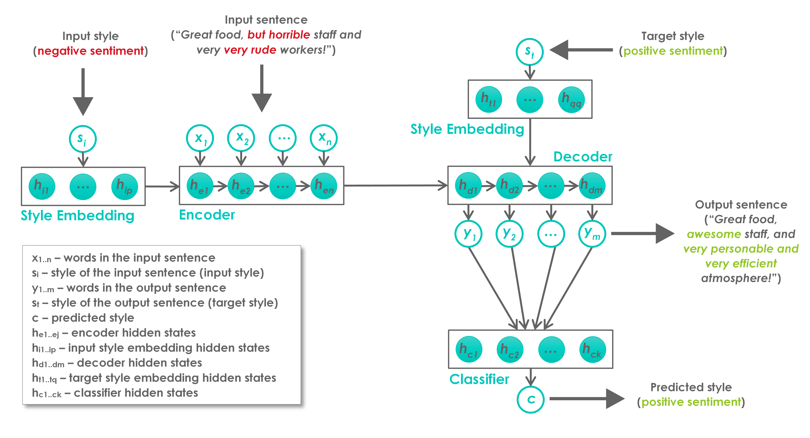

# A Review of Text Style Transfer with Deep Learning

This is the official repository for the paper [A Review of Text Style Transfer with Deep
Learning](https://ieeexplore.ieee.org/abstract/document/9551764).

Style is an integral component of a sentence indicated by the choice of words a person makes.
Different people have different ways of expressing themselves, however, they adjust their speaking
and writing style to a social context, an audience, an interlocutor or the formality of an occasion.
Text style transfer is defined as a task of adapting and/or changing the stylistic manner in
which a sentence is written, while preserving the meaning of the original sentence.

A systematic review of text style transfer methodologies using deep learning is presented in this
paper. We point out the technological advances in deep neural networks that have been the driving
force behind current successes in the fields of natural language understanding and generation. The
review is structured around two key stages in the text style transfer process, namely,
representation learning and sentence generation in a new style. The discussion highlights the
commonalities and differences between proposed solutions as well as challenges and opportunities
that are expected to direct and foster further research in the field.

Read the full paper [here](https://arxiv.org/pdf/2109.15144). If you find this review useful,
please kindly cite our paper:

```
@article{toshevska2021review,
  title={A review of text style transfer using deep learning},
  author={Toshevska, Martina and Gievska, Sonja},
  journal={IEEE Transactions on Artificial Intelligence},
  volume={3},
  number={5},
  pages={669--684},
  year={2021},
  publisher={IEEE}
}
```

We group the models for style transfer into three groups according to the architectural blocks for
generating the output sentence: *simple reconstruction models*, *models with style classifiers*, and
*adversarial models*. A general architecture for text style transfer is depicted in the
following figure:


- `Simple reconstruction models` are trained to simply reconstruct the sentences based on the
  reconstruction loss (called self-reconstruction).
    - J. Li, R. Jia, H. He, and P. Liang, *“Delete, Retrieve, Generate: A simple approach to
      sentiment and style transfer,”* in Proceedings of the 2018 Conference of the North American
      Chapter of the Association for Computational Linguistics: Human Language Technologies, Volume
      1 (Long Papers), 2018, pp. 1865–1874.

    - A. Sudhakar, B. Upadhyay, and A. Maheswaran, *““Transforming” Delete, Retrieve, Generate
      approach for controlled text style transfer,”* in Proceedings of the 2019 Conference on
      Empirical Methods in Natural Language Processing and the 9th International Joint Conference on
      Natural Language Processing (EMNLPIJCNLP), 2019, pp. 3260–3270.

    - Y. Zhang, J. Xu, P. Yang, and X. Sun, *“Learning sentiment memories for sentiment modification
      without parallel data,”* in Proceedings of the 2018 Conference on Empirical Methods in Natural
      Language Processing, 2018, pp. 1103–1108.

    - Y. Zhang, N. Ding, and R. Soricut, *“SHAPED: SharedPrivate Encoder-Decoder for text style
      adaptation,”* in Proceedings of the 2018 Conference of the North American Chapter of the
      Association for Computational Linguistics: Human Language Technologies, Volume 1 (Long
      Papers), 2018, pp. 1528–1538.

    - G. Lample, S. Subramanian, E. Smith, L. Denoyer, M. Ranzato, and Y.-L. Boureau,
      *“Multiple-attribute text rewriting,”* in International Conference on Learning
      Representations, 2018.

- `Models with a style classifier` incorporate additional style classifier(s) to assist in the
  generation of the output sentences.
    - R. Xu, T. Ge, and F. Wei, *“Formality style transfer with hybrid textual annotations,”*
      CoRR, 2019.

    - N. Dai, J. Liang, X. Qiu, and X.-J. Huang, *“Style Transformer: Unpaired text style transfer
      without disentangled latent representation,”* in Proceedings of the 57th Annual Meeting of the
      Association for Computational Linguistics, 2019, pp. 5997–6007.

    - Y. Cheng, Z. Gan, Y. Zhang, O. Elachqar, D. Li, and J. Liu, *“Contextual text style
      transfer,”* CoRR, 2020.

    - C. dos Santos, I. Melnyk, and I. Padhi, *“Fighting offensive language on social media with
      unsupervised text style transfer,”* in Proceedings of the 56th Annual Meeting of the
      Association for Computational Linguistics (Volume 2: Short Papers), 2018, pp. 189–194.

    - S. Prabhumoye, Y. Tsvetkov, R. Salakhutdinov, and A. W. Black, *“Style transfer through
      back-translation,”* in Proceedings of the 56th Annual Meeting of the Association for
      Computational Linguistics (Volume 1: Long Papers), 2018, pp. 866–876.

    - S. Prabhumoye, Y. Tsvetkov, A. W. Black, and R. Salakhutdinov, *“Style transfer through
      multilingual and feedback-based back-translation,”* CoRR, 2018.

    - Y. Tian, Z. Hu, and Z. Yu, *“Structured content preservation for unsupervised text style
      transfer,”* CoRR, 2018.

    - D. Liu, J. Fu, Y. Zhang, C. Pal, and J. Lv, *“Revision in continuous space: Unsupervised
      text style transfer without adversarial learning,”* in The ThirtyFourth AAAI Conference on
      Artificial Intelligence, AAAI 2020, The Thirty-Second Innovative Applications of Artificial
      Intelligence Conference, IAAI 2020, The Tenth AAAI Symposium on Educational Advances in
      Artificial Intelligence, EAAI 2020, New York, NY, USA, February 7-12, 2020. AAAI Press, 2020,
      pp. 8376–8383.

    - K. Wang, H. Hua, and X. Wan, *“Controllable unsupervised text attribute transfer via editing
      entangled latent representation,”* in Advances in Neural Information Processing Systems, 2019,
      pp. 11 036–11 046.

    - C. Zhou, L. Chen, J. Liu, X. Xiao, J. Su, S. Guo, and H. Wu, *“Exploring contextual word-level
      style relevance for unsupervised style transfer,”* in Proceedings of the 58th Annual
      Meeting of the Association for Computational Linguistics, ACL 2020, Online, July 5-10, 2020,
      D. Jurafsky, J. Chai, N. Schluter, and J. R. Tetreault, Eds. Association for Computational
      Linguistics, 2020, pp. 7135–7144.

    - J. Lee, *“Stable Style Transformer: Delete and Generate approach with Encoder-Decoder for text
      style transfer,”* CoRR, 2020.

    - H. Kim and K.-A. Sohn, *“How positive are you: Text style transfer using adaptive style
      embedding,”* in Proceedings of the 28th International Conference on Computational Linguistics,
      2020, pp. 2115–2125.

- `Adversarial models` are built upon GAN architecture.
    - Z. Fu, X. Tan, N. Peng, D. Zhao, and R. Yan, *“Style transfer in text: Exploration and
      evaluation,”* in ThirtySecond AAAI Conference on Artificial Intelligence, 2018.

    - V. John, L. Mou, H. Bahuleyan, and O. Vechtomova, *“Disentangled representation learning for
      non-parallel text style transfer,”* in Proceedings of the 57th Annual Meeting of the
      Association for Computational Linguistics, 2019, pp. 424–434.

    - Z. Hu, Z. Yang, X. Liang, R. Salakhutdinov, and E. P. Xing, *“Toward controlled generation of
      text,”* in Proceedings of the 34th International Conference on Machine Learning-Volume 70,
      2017, pp. 1587–1596.

    - T. Shen, T. Lei, R. Barzilay, and T. Jaakkola, *“Style transfer from non-parallel text by
      cross-alignment,”* in Advances in neural information processing systems, 2017, pp. 6830–6841.

    - Y. Zhao, W. Bi, D. Cai, X. Liu, K. Tu, and S. Shi, *“Language style transfer from sentences
      with arbitrary unknown styles,”* CoRR, 2018.

    - L. Logeswaran, H. Lee, and S. Bengio, *“Content preserving text generation with attribute
      controls,”* in Advances in Neural Information Processing Systems, 2018, pp. 5103–5113.

    - L. Chen, S. Dai, C. Tao, H. Zhang, Z. Gan, D. Shen, Y. Zhang, G. Wang, R. Zhang, and L. Carin,
      *“Adversarial text generation via feature-mover’s distance,”* in Advances in Neural
      Information Processing Systems, 2018, pp. 4666–4677.

    - X. Li, G. Chen, C. Lin, and R. Li, *“DGST: a dualgenerator network for text style transfer,
      ”* in Proceedings of the 2020 Conference on Empirical Methods in Natural Language Processing,
      EMNLP 2020, Online, November 16-20, 2020, B. Webber, T. Cohn, Y. He, and Y. Liu, Eds.
      Association for Computational Linguistics, 2020, pp. 7131–7136.
  
    - X. Yi, Z. Liu, W. Li, and M. Sun, *“Text style transfer via learning style instance supported
      latent space.”* IJCAI, 2020.

    - Y. Duan, C. Xu, J. Pei, J. Han, and C. Li, *“Pre-train and Plug-in: Flexible conditional text
      generation with variational auto-encoders,”* in Proceedings of the 58th Annual Meeting of the
      Association for Computational Linguistics, 2020, pp. 253–262.
  
    - Y. Huang, W. Zhu, D. Xiong, Y. Zhang, C. Hu, and F. Xu, *“Cycle-consistent adversarial
      autoencoders for unsupervised text style transfer,”* in Proceedings of the 28th International
      Conference on Computational Linguistics, 2020, pp. 2213–2223.